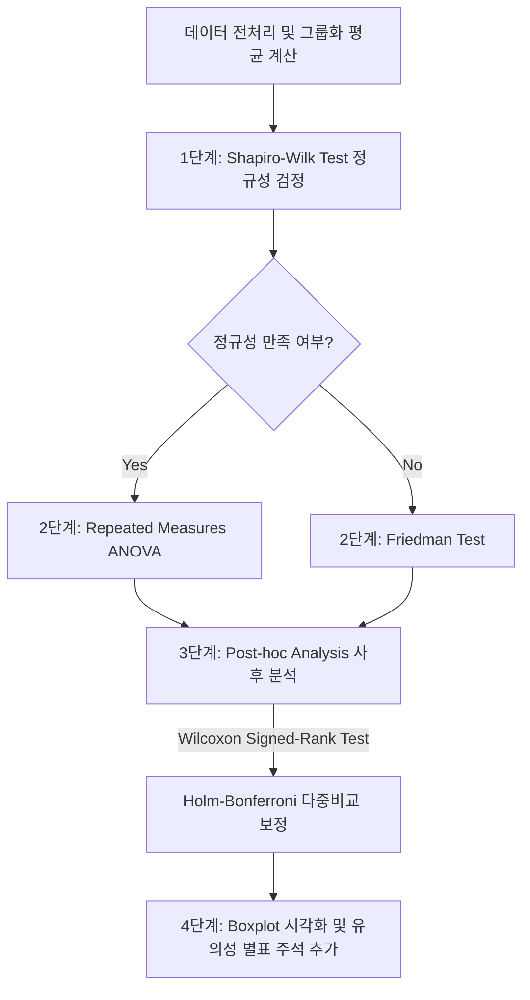

# VR Interaction Analysis Pipeline

본 프로젝트는 VR 환경에서의 다양한 인터랙션 방식(입력 방식)에 따른 사용자 경험(UX) 평가 항목(Embodiment, Immersion, Agency) 및 작업 수행 시간(Time Data)을 통계적으로 비교·분석하고 시각화하는 데이터 분석 파이프라인입니다.

---

## 📂 디렉토리 구조 및 주요 파일

```text
📁 VR인터렉션논문
│
├── 📁 Analysis_Code                 # 통계 분석 및 시각화 스크립트 폴더
│   ├── 📄 1_Shapiro-Wilk_Test.py    # 정규성 검정 스크립트
│   ├── 📄 2_Friedman.py             # 조건 평가 스크립트 (RM-ANOVA 또는 Friedman Test)
│   ├── 📄 3_Post_hoc.py             # 사후 분석 스크립트 (Wilcoxon Signed-Rank Test + Holm 보정)
│   ├── 📄 4_Vis_Post-mortem.py      # 개별 평가요소별 사후분석 주석 포함 Boxplot 시각화
│   ├── 📄 4_Vis_Post-mortem_all.py  # 전체 평가요소 비교 Grouped Boxplot 시각화
│   ├── 📄 5_Vis_Preference.py       # 설문 문항별 입력방식 선호도 Stacked Bar Chart 시각화
│   ├── 📄 TimeData_Pro.py           # 시간 데이터 파일(txt) 수집 및 엑셀 취합 전처리
│   ├── 📄 분석단계.txt              # 통계 분석 기준 요약 설명 파일
│   ├── 📄 Friedman Test.py         # (테스트용) 프리드먼 검정 및 RM-ANOVA 검증 스크립트
│   └── 📄 Shapiro_Test.py           # (테스트용) 샤피로-윌크 검정 검증 스크립트
│
├── 📊 VR_Interactions(응답).xlsx     # 설문 응답 원본 및 종합 분석 엑셀 데이터
└── 📄 README.md                     # 본 문서
```


---

## 📊 데이터셋 설명 (`VR_Interactions(응답).xlsx`)
설문 응답 원본 및 종합 분석 엑셀 파일 | [👉 구글 시트 바로가기](https://docs.google.com/spreadsheets/d/101oOURndPKaQ86eVRk13mVtfGzbAHlX7VOADIec8h7g/edit?gid=565853200#gid=565853200) |

이 데이터셋은 참가자들의 VR 인터랙션 실험에 대한 설문 및 시간 기록 데이터를 포함하고 있으며, 다음과 같은 시트들로 구성되어 있습니다.

| 시트 이름 | 설명 |
| :--- | :--- |
| **키보드타이핑(설문)** | 키보드 타이핑 태스크 수행 후 사용자 경험 평가 데이터 |
| **칠교(설문)** | 칠교놀이(Tangram) 태스크 수행 후 사용자 경험 평가 데이터 |
| **비디오(설문)** | 비디오 플레이어 조작 태스크 수행 후 사용자 경험 평가 데이터 |
| **UEQ(설문)** | User Experience Questionnaire(사용자 경험 설문) 원본 데이터 |
| **UEQ분석** | UEQ 벤치마크 및 스케일별 분석 결과 데이터 |
| **RCQ&정규성** | 통계 정규성 검증 데이터 |
| **유효성 검증** | 조건 간 유의미한 차이가 있는지 검증한 통계 데이터 |
| **사후분석** | 유의미한 차이가 있는 조건 쌍에 대한 사후 분석 결과 데이터 |
| **TAAQ** | 기술 수용도 및 태도 평가 설문 데이터 |
| **시간데이터** | 각 태스크 수행 시간 로그 데이터 |

---

## 🔄 데이터 분석 프로세스 (통계 분석 파이프라인)

`분석단계.txt`에 정의된 가이드라인에 따라 아래의 흐름으로 통계적 검증 및 시각화가 진행됩니다.



### 1. 정규성 검정 (`1_Shapiro-Wilk_Test.py`)
- 목적: 각 입력 방식(Way of working)과 평가 요소(Evaluation factors: Embodiment, Immersion, Agency)별 점수 분포가 정규분포를 따르는지 검정합니다.
- **판정 기준**:
  - $p > 0.05$ : 정규성 만족 (`normalization` = `yes`)
  - $p \le 0.05$ : 정규성 만족하지 않음 (`normalization` = `No`)


### 2. 조건 평가 (`2_Friedman.py`)
- 목적: 입력 방식에 따른 평가 요소별 점수의 유의미한 차이가 있는지 확인합니다.
- 검정 방법 선택:
  - **정규성 만족 (`yes`)**: **Repeated Measures ANOVA** (반복측정 분산분석) 수행
  - **정규성 불만족 (`No`)**: **Friedman Test** (비모수 검정) 수행
- **판정 기준**: $p < 0.05$ 일 때 조건 간 유의미한 차이가 있는 것으로 판정 (`Significant` = `yes`)


### 3. 사후 분석 (`3_Post_hoc.py`)
- 목적: 조건 간의 구체적인 차이를 규명하기 위해 일대일(Pairwise) 비교를 수행합니다.
- 검정 방법: **Wilcoxon signed-rank test** (양측 검정, zero_method='wilcox')
- **다중 비교 보정**: 1종 오류(Type I Error) 증가를 방지하기 위해 **Holm 보정(Holm-Bonferroni method)**을 적용합니다.


### 4. 시각화 및 결과 저장 (`4_Vis_Post-mortem.py` & `4_Vis_Post-mortem_all.py`)
- 개별 시각화 (`4_Vis_Post-mortem.py`)**: 각 평가 요소별 Boxplot을 생성하고, 사후분석 결과 유의미한 차이가 있는 비교 쌍에 대해 `statannotations.Annotator`를 사용해 별표(`*`, `**`, `***`) 주석을 자동으로 추가하여 저장합니다.
- 종합 시각화 (`4_Vis_Post-mortem_all.py`)**: Agency, Embodiment, Immersion 세 가지 요소를 한 그래프에 모아 입력 방식별로 비교하는 Grouped Boxplot을 생성하고 사후분석 주석을 표기합니다.


### 5. 선호도 설문 시각화 (`5_Vis_Preference.py`)
- 목적: 사용자가 직접 선택한 선호 입력 방식("컨트롤러 직접", "컨트롤러 레이캐스팅", "핸드트래킹", "손목회전")에 대한 문항별 응답 비율을 백분율로 환산하여 **Stacked Bar Chart**로 시각화합니다.
- 결과: `Preference_Visualization` 폴더 내에 시각화 이미지와 엑셀 집계 데이터를 저장합니다.


---

## 🛠️ 개발 및 실행 환경 구축

본 파이프라인은 Python 환경에서 실행되며, 분석 및 시각화를 위해 아래 패키지들이 필요합니다.

### 1. 필수 라이브러리 설치
```bash
pip install pandas numpy scipy statsmodels openpyxl matplotlib seaborn statannotations
```

> [!WARNING]
> **라이브러리 버전 주의**
> `statannotations` 라이브러리는 `seaborn` 및 `matplotlib` 최신 버전과의 호환성에 따라 경고나 오류가 발생할 수 있습니다. 정상 동작을 위해 가상환경을 구축하여 사용하는 것을 권장합니다.

### 2. 실행 시 주의사항
- **파일명 수정**: 파이썬 코드의 기본 엑셀 입력 경로가 `VR_Interactions_Python.xlsx`로 하드코딩되어 있습니다. 본 프로젝트의 원본 파일인 `VR_Interactions(응답).xlsx`를 사용하려면 파일명을 복사하여 `VR_Interactions_Python.xlsx`로 이름을 변경하거나, 파이썬 스크립트 상단의 `file_path` 변수값을 수정해 주어야 합니다.
- **평가유소/입력방식(Type_name) 설정**: `1_Shapiro-Wilk_Test.py` 등의 스크립트 상단에 정의된 `Type_name` 변수("Keyboard", "object", "UI" 등)에 따라 처리하는 타겟 시트가 변경되므로 분석 대상에 맞추어 변수값을 알맞게 변경하여 실행하십시오.
