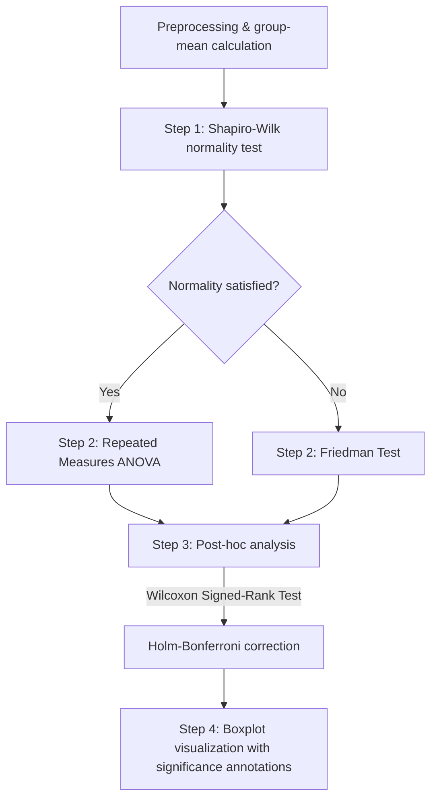

# VR Interaction Analysis Pipeline

A data analysis pipeline that statistically compares and visualizes user experience (UX) metrics (Embodiment, Immersion, Agency) and task completion time across different VR interaction (input) methods.

---

## 📂 Directory Structure

```text
📁 VR_Interactio_Analysis
│
├── 📁 Analysis_Code                            # Statistical analysis & visualization scripts
│   ├── 📄 1_Shapiro-Wilk_Test.py               # Normality test
│   ├── 📄 2_Friedman.py                        # Condition evaluation (RM-ANOVA or Friedman Test)
│   ├── 📄 3_Post_hoc.py                        # Post-hoc analysis (Wilcoxon Signed-Rank + Holm correction)
│   ├── 📄 4_Vis_Post-mortem.py                 # Per-factor Boxplot with post-hoc annotations
│   ├── 📄 4_Vis_Post-mortem_all.py             # Grouped Boxplot across all evaluation factors
│   ├── 📄 5_Vis_Preference.py                  # Stacked Bar Chart of input-method preference per question
│   ├── 📄 TimeData_Pro.py                      # Collects raw time logs (.txt) and aggregates them into Excel
│   ├── 📄 Friedman Test.py                     # (sandbox) Friedman / RM-ANOVA verification script
│   ├── 📄 Shapiro_Test.py                      # (sandbox) Shapiro-Wilk verification script
│   │
│   ├── 📁 TimeData                             # Raw time logs + aggregated time data
│   │   ├── 📁 results_1 ... results_20         # Per-participant .txt time logs
│   │   ├── 📊 Keyboard_TimeData.xlsx           # (generated) aggregated keyboard task times
│   │   ├── 📊 Tangram_TimeData.xlsx            # (generated) aggregated tangram task times
│   │   └── 📊 Videoplayer_TimeData.xlsx        # (generated) aggregated video player task times
│   │
│   ├── 📊 VR_Interactions_Python_EN.xlsx       # Analysis input (English) — read by every script
│   ├── 📊 VR_Interactions_Python_Ko.xlsx       # Analysis input (Korean, legacy)
│   ├── 📊 VR_Interactions_Analysis_UI_Results.xlsx  # (generated) analysis results for Type_name = "UI"
│   └── 🖼️ UI_Grouped_Boxplot.png               # (generated) grouped boxplot output
│
├── 📊 VR_Interactions_En.xlsx                  # Master survey workbook (raw responses + summary analysis)
└── 📄 README.md                                # This document
```

> Generated artifacts (`*_Results.xlsx`, `*_Grouped_Boxplot.png`, `*_boxplot_posthoc_annotated/`, `Preference_Visualization/`, `*_TimeData.xlsx`) are produced by the scripts and are written next to them inside `Analysis_Code`.

---

## 📊 Datasets

### 1. Master survey workbook (`VR_Interactions_En.xlsx`)

Raw survey responses and summary analysis | [👉 Open in Google Sheets](https://docs.google.com/spreadsheets/d/101oOURndPKaQ86eVRk13mVtfGzbAHlX7VOADIec8h7g/edit?gid=565853200#gid=565853200)

| Sheet | Description |
| :--- | :--- |
| **Keyboard Prefer** | Preferred input method per question — keyboard typing task |
| **object Prefer** | Preferred input method per question — object interaction (tangram) task |
| **UI Prefer** | Preferred input method per question — UI control (video player) task |
| **UEQ Prefer** | Preferred input method per question — UEQ items |
| **UEQ** | User Experience Questionnaire raw data |
| **RCQ&Normality** | Normality verification data |
| **Validation** | Test of whether conditions differ significantly |
| **Post-hoc analysis** | Post-hoc results for condition pairs with significant differences |
| **TAAQ** | Technology acceptance / attitude questionnaire data |
| **TimeData** | Task completion time logs |

### 2. Analysis input (`Analysis_Code/VR_Interactions_Python_EN.xlsx`)

This is the file the Python scripts actually read. Its sheets are keyed by the `Type_name` variable defined at the top of each script.

| Sheet | Used by | `Type_name` |
| :--- | :--- | :--- |
| **Keyboard** | Steps 1–4 | `"Keyboard"` |
| **object** | Steps 1–4 | `"object"` |
| **UI** | Steps 1–4 | `"UI"` |
| **Keyboard_Preference** / **object_Preference** / **UI_Preference** | Step 5 (`5_Vis_Preference.py`) | matching `Type_name` |
| **Test** | Sandbox scripts | — |

### 3. Time logs (`Analysis_Code/TimeData/`)

`TimeData_Pro.py` walks `TimeData/results_*/` and parses files named `Player_<n>_<Task>_<Condition>.txt`, where:

- **Task**: `Keyboard`, `Tangram`, `Videoplayer`
- **Condition**: `Controller_Direct`, `Controller_Raycast`, `Hand_Direct`, `Real`, `Wrist`

It writes one workbook per task (`<Task>_TimeData.xlsx`) with a sheet per condition plus a `Summary` sheet.

---

## 🔄 Analysis Pipeline



Each step reads and appends to the same results workbook, `VR_Interactions_Analysis_{Type_name}_Results.xlsx`, so **the scripts must be run in numbered order** for a given `Type_name`.

### 1. Normality test (`1_Shapiro-Wilk_Test.py`)
- **Purpose**: test whether score distributions follow a normal distribution for each input method (`way of working`) and evaluation factor (Embodiment, Immersion, Agency).
- **Decision rule**:
  - $p > 0.05$ : normality satisfied (`normalization` = `yes`)
  - $p \le 0.05$ : normality not satisfied (`normalization` = `No`)
- **Output sheets**: `{Type_name}_df_grouped`, `{Type_name}_Shapiro-Wilk`

### 2. Condition evaluation (`2_Friedman.py`)
- **Purpose**: determine whether scores differ significantly across input methods for each evaluation factor.
- **Test selection**:
  - **Normality satisfied (`yes`)**: **Repeated Measures ANOVA**
  - **Normality not satisfied (`No`)**: **Friedman Test** (non-parametric)
- **Decision rule**: $p < 0.05$ → conditions differ significantly (`Significant` = `yes`)
- **Output sheet**: `{Type_name}_Condition Evaluation`

### 3. Post-hoc analysis (`3_Post_hoc.py`)
- **Purpose**: pairwise comparisons to identify which specific conditions differ.
- **Test**: **Wilcoxon signed-rank test** (two-sided, `zero_method='wilcox'`)
- **Multiple-comparison correction**: **Holm-Bonferroni** correction, to control Type I error inflation.
- **Output sheet**: `{Type_name}_Posthoc_Wilcoxon`

### 4. Visualization (`4_Vis_Post-mortem.py` & `4_Vis_Post-mortem_all.py`)
- **Per-factor (`4_Vis_Post-mortem.py`)**: generates one Boxplot per evaluation factor and uses `statannotations.Annotator` to automatically add significance stars (`*`, `**`, `***`) for pairs found significant in the post-hoc step. Saved to `{Type_name}_boxplot_posthoc_annotated/`.
- **Combined (`4_Vis_Post-mortem_all.py`)**: generates a Grouped Boxplot comparing Agency, Embodiment and Immersion side by side across input methods, with post-hoc annotations. Saved to `{Type_name}_Grouped_Boxplot.png`.

### 5. Preference visualization (`5_Vis_Preference.py`)
- **Purpose**: convert per-question responses for the user's preferred input method (Direct controller interaction, Controller raycasting interaction, Hand tracking interaction, Wrist rotation interaction) into percentages and render them as a **Stacked Bar Chart**.
- **Input sheet**: `{Type_name}_Preference`
- **Output**: chart image and aggregated Excel data in the `Preference_Visualization/` folder.

### (Optional) Time data preprocessing (`TimeData_Pro.py`)
- Collects the raw `.txt` time logs under `TimeData/` and aggregates them into per-task Excel workbooks. Run this independently of the statistical pipeline.

---

## 🛠️ Environment & Execution

The pipeline runs on Python and requires the following packages.

### 1. Install dependencies
```bash
pip install pandas numpy scipy statsmodels openpyxl matplotlib seaborn statannotations
```

> [!WARNING]
> **Library version caution**
> `statannotations` may emit warnings or errors depending on the installed `seaborn` / `matplotlib` versions. A dedicated virtual environment is recommended.

### 2. Notes before running
- **Working directory**: all input/output paths are relative, so run the scripts from inside `Analysis_Code/` (e.g. `cd Analysis_Code && python 1_Shapiro-Wilk_Test.py`).
- **Input file**: `file_path` is hardcoded to `VR_Interactions_Python_EN.xlsx`. To analyze the Korean workbook instead, change `file_path` to `VR_Interactions_Python_Ko.xlsx` at the top of each script.
- **`Type_name` setting**: the `Type_name` variable at the top of each script (`"Keyboard"`, `"object"`, `"UI"`) selects both the target sheet and the results workbook. Set it to the target task before running, and keep it consistent across steps 1 → 4.
- **Fonts**: the visualization scripts set `plt.rcParams['font.family'] = 'Malgun Gothic'` (a Windows font). On macOS/Linux, change it to an available font such as `AppleGothic` or `NanumGothic`.
